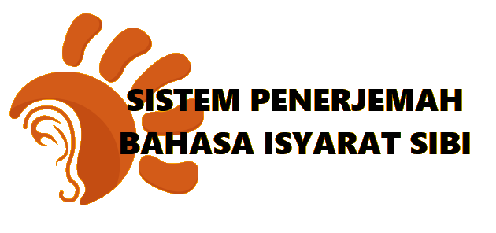
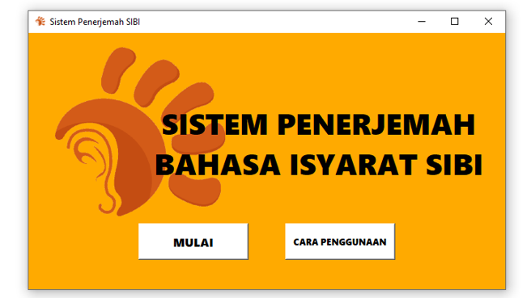
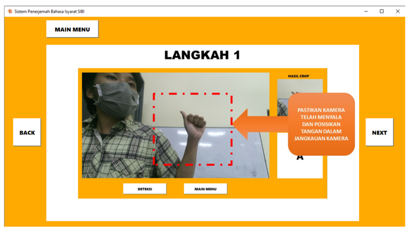
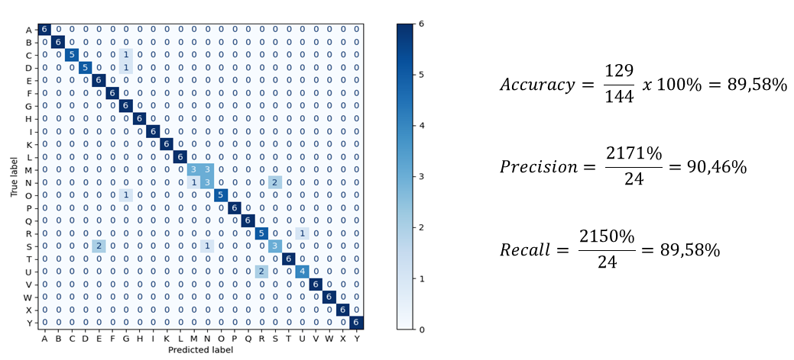

# SIBI Translator System

<!-- PROJECT LOGO -->

  

<!-- TABLE OF CONTENTS -->
## Table of Contents
- [About the Project](#about-the-project)
- [Tech Stack](#tech-stack)
- [System Manufacturing](#system-manufacturing)
- [Testing](#testing)
- [Team Member](#team-member)

<!-- ABOUT THE PROJECT -->
## About The Project

Sign language is one of the languages used by deaf or speech impaired people to communicate with other people. In Indonesia, the sign language used is the Sistem Isyarat Bahasa Indonesia (SIBI). SIBI is used as a sign language that is learned in Special Schools (SLB). However, people in general still do not understand the SIBI language. This becomes an obstacle for deaf impaired people to communicate with the community.

To solve this problem, a desktop-based system was designed to translate the SIBI language. The system was built using the Python programming language. To translate the SIBI language, K-Nearest Neighbor (K-NN) classification method and Kinect XBOX ONE 2.0 Camera as a medium for image data retrieval is implemented. The system is also equipped with a hand keypoints feature to assist the hand detection process.

## Tech Stack

## System Manufacturing

This system is built using Python version 3.8.6. The camera used to take images is the Kinect V 2.0. The user interfaces is built using PyQT. The system UI and simulation are shown below:

- <b>Main Menu Interfaces</b>

- <b>How-to-Use Menu Interface</b>

- <b>Translator Menu Interface</b>

https://user-images.githubusercontent.com/46621608/197375059-7f3a9beb-cfab-4859-9068-f5540898f15d.mp4

## Testing

The system built can only detect static motion. So the letters J and Z are not tested, because they are sign languages with dynamic movements. The test was conducted on 3 male students and 3 female students. The test results are entered into the confusion matrix table to find accuracy, precision, and recall on the system. The test results are as follows:

## Team Member
- Muhamad Dwi Arifianto
- Muhammad Ilham
- Sholikhatul Amalia
